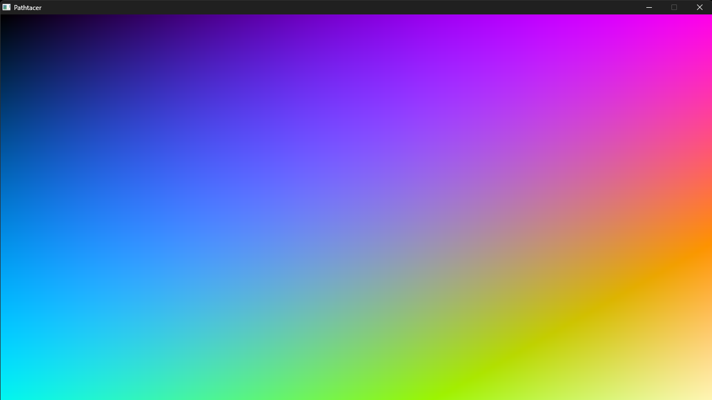
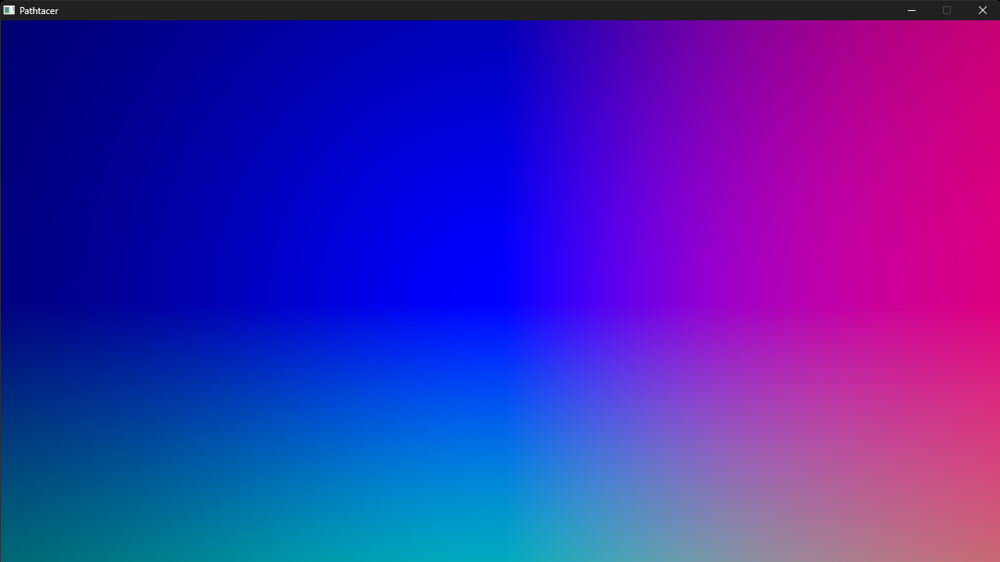
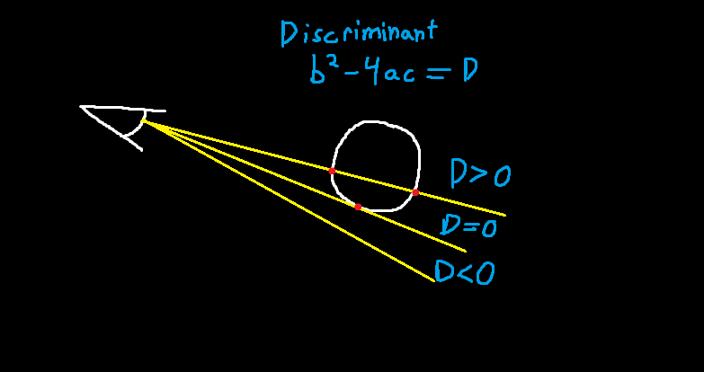
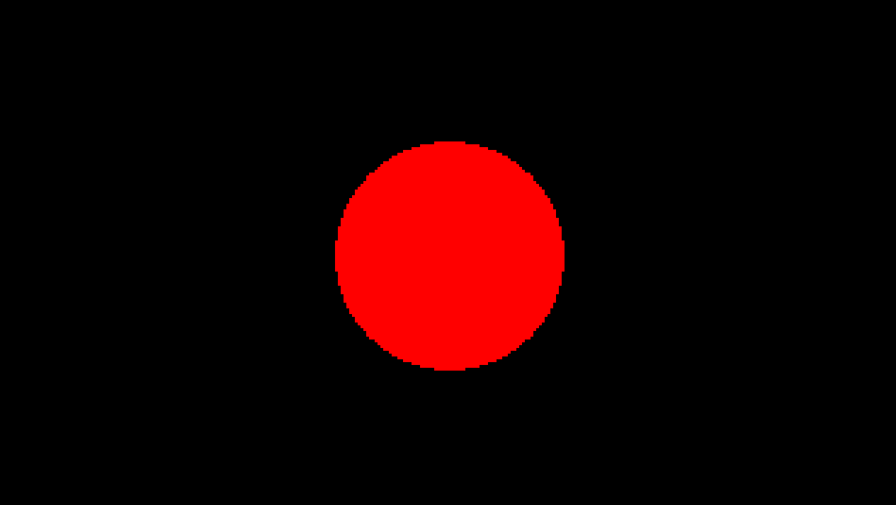
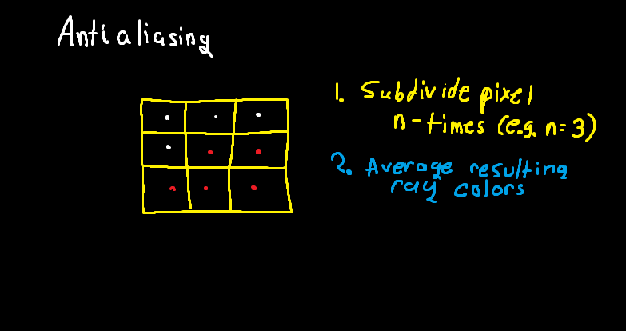
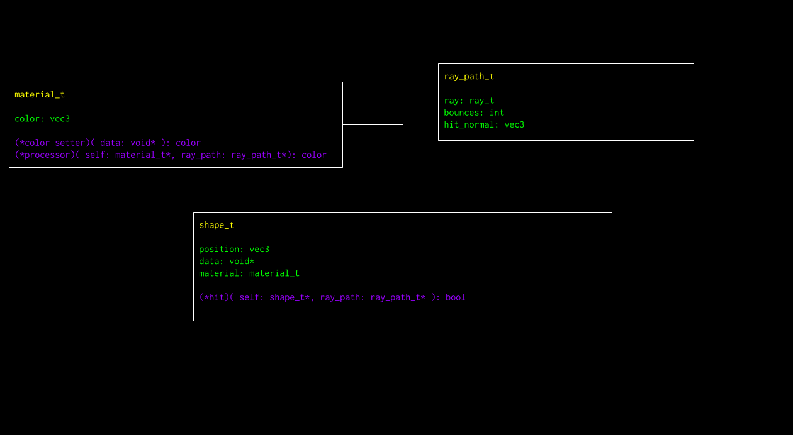
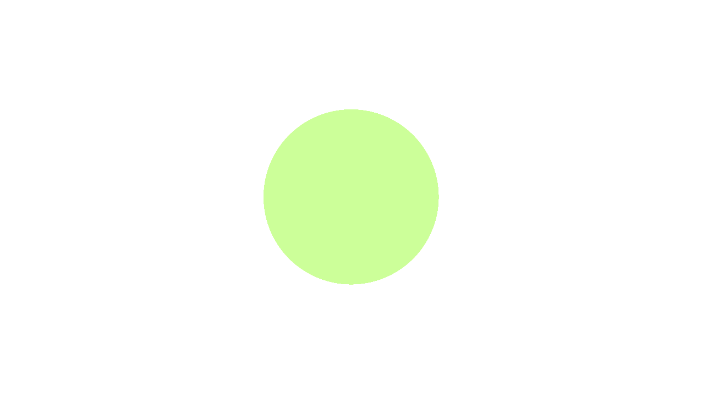
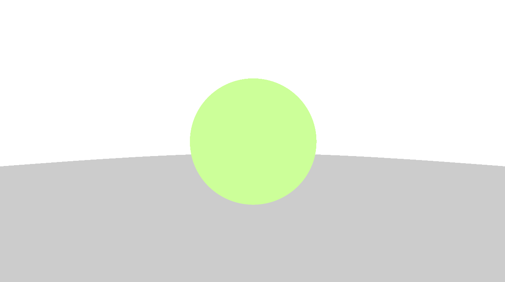
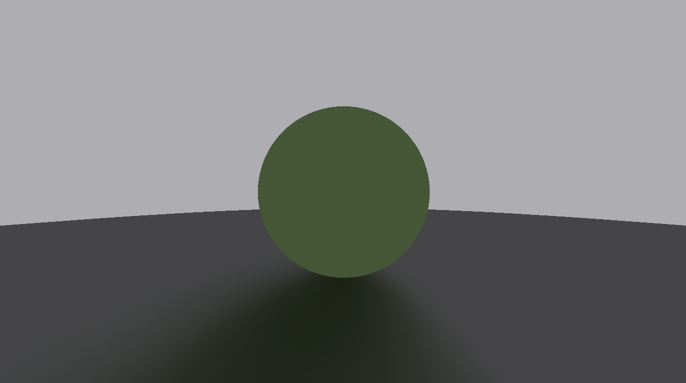

# pathtracer-c

Writing another pathtracer in C.

## Build Instructions
- Download the devel-mingw version of [SDL3](https://github.com/libsdl-org/SDL/releases/tag/release-3.2.28)
- Extract the `SDL3` folder containing headers to the include folder
- Create a `/bin` directory (in the main directory) and extract `SDL3.dll` into it
- Create a `/lib` directory (also in the main directory) and extract `libSDL3.dll.a` into it
- Download the latest release of [chelp](https://github.com/thbop/chelp/releases) and extract libchelp.a into the `/lib` directory (the headers for chelp are already included in this repo)
- Run `make`, `pathtracer.exe` should be generated in the `/bin` folder

## Reports

    
Chapter 0

    
    
In this section, I created a thread which renders pixels to the screen using SDL3.

    
Chapter 1

    
    
In this section, I created a camera and generated rays for each pixel (ray directions represented as colors).

    
Chapter 2

    
    
    
In this section, I solved for ray-sphere intersection, drawing a flat sphere.

    

    
Chapter 3

    
    
    
In this section, I upscaled the render output, flipped the vertical axis right-side-up, and implemented configurable subpixel rays for antialiasing.

    
Chapter 4

    
    
In this section, I started bouncing light.

    
Chapter 5

    
    
    
In this section, I refactored the intersection tests and material properties into separate classes. Shapes and materials ought to be more extendable.

    
Chapter 6

    
    
Successful render of multiple spheres, though light does not appear to be behaving as expected.

    
Chapter 7

    
    
Fixed some mistaken math and made rays sort objects better. Now it is kind of rendering, though I believe the green sphere should not be that flat.

